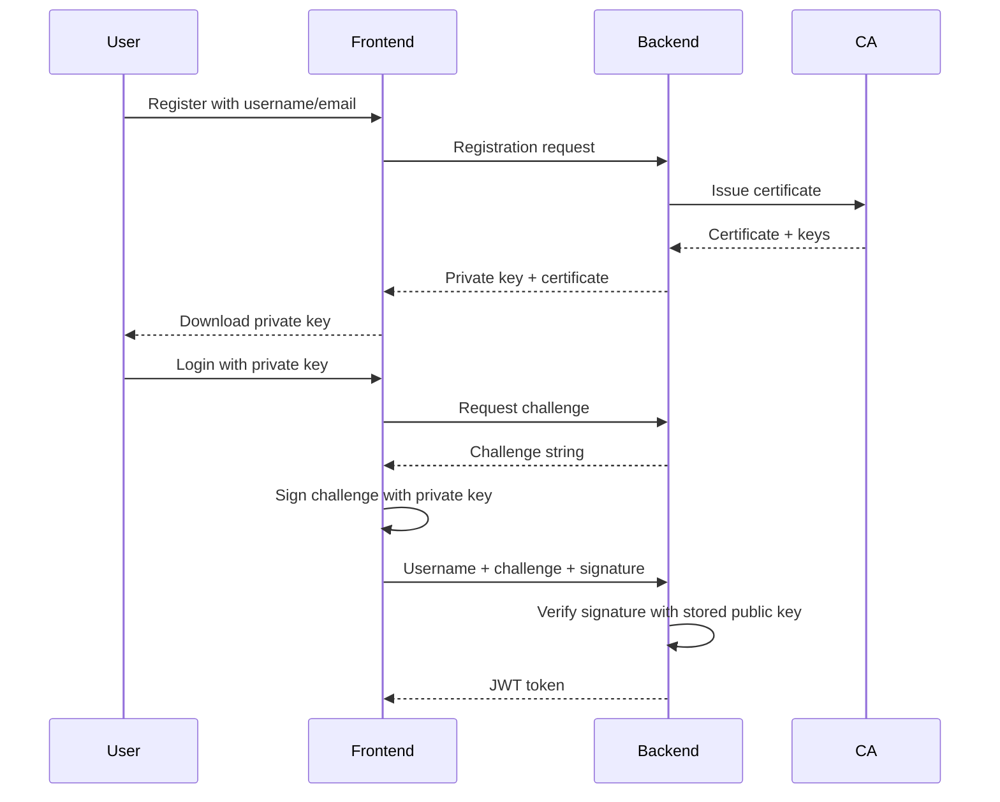

# 🔐 Secure File Sharing Application

A modern, secure file sharing application built with React, Node.js, and MongoDB, featuring **PKI-based authentication** using digital certificates and signatures.

## ✨ Features

- **🔒 PKI Authentication**: Certificate-based user authentication with digital signatures
- **🔐 End-to-End Encryption**: RSA + AES hybrid encryption for secure file sharing
- **📁 File Management**: Upload, download, and share files securely
- **💬 Secure Messaging**: Encrypted messaging between users
- **🏛️ Certificate Authority**: Built-in CA for certificate issuance and management
- **🛡️ Security Features**: Rate limiting, input validation, and comprehensive error handling

## 🚀 Quick Start

### Prerequisites

- **Node.js** 16+ ([Download](https://nodejs.org/))
- **MongoDB** ([Installation Guide](https://docs.mongodb.com/manual/installation/))
- **Git** ([Download](https://git-scm.com/))

### 1. Clone and Setup

```bash
# Clone the repository
git clone <repository-url>
cd secure-file-sharing

# Make setup script executable
chmod +x setup-complete.sh

# Run the complete setup
./setup-complete.sh
```

The setup script will:
- ✅ Check system requirements
- ✅ Install all dependencies
- ✅ Create configuration files
- ✅ Test the setup
- ✅ Create startup scripts

### 2. Configure Environment

Update the configuration files:

**Backend Configuration** (`backend/.env`):
```env
PORT=5000
NODE_ENV=development
MONGO_URI=mongodb://localhost:27017/secure_app
JWT_SECRET=your_super_secure_jwt_secret_key_here_change_in_production
FRONTEND_URL=http://localhost:3000
```

**Frontend Configuration** (`frontend/.env`):
```env
REACT_APP_API_URL=http://localhost:5000
REACT_APP_DEBUG=true
```

### 3. Start the Application

```bash
# Development mode (auto-reload)
./start-dev.sh

# Production mode
./start-prod.sh
```

### 4. Access the Application

- 🌐 **Frontend**: http://localhost:3000
- 📡 **Backend API**: http://localhost:5000
- 📊 **Health Check**: http://localhost:5000/health

## � How to Use

### Registration Process

1. **Visit the registration page**
2. **Enter your username and email**
3. **Click "Create Account"**
4. **Download your private key and certificate** (automatically downloaded)
5. **Store your private key securely** - you'll need it to log in

### Login Process

1. **Visit the login page**
2. **Enter your username**
3. **Upload your private key file** (.pem file downloaded during registration)
4. **Click "Sign In"**
5. **You'll be authenticated using digital signature verification**

### File Sharing

1. **Upload files** - they're encrypted automatically
2. **Share files** with other users by username
3. **Download shared files** - they're decrypted automatically
4. **Send secure messages** to other users

## 🔧 Architecture

### Authentication Flow



### Security Features

- **Digital Signatures**: Every login verified using RSA signatures
- **Certificate Authority**: Self-signed CA for certificate management
- **Hybrid Encryption**: RSA for key exchange, AES for data encryption
- **JWT Tokens**: Secure session management
- **Rate Limiting**: Protection against brute force attacks
- **Input Validation**: Comprehensive input sanitization
- **CORS Protection**: Secure cross-origin requests

## �️ Development

### Project Structure

```
secure-file-sharing/
├── backend/                 # Node.js API server
│   ├── routes/             # API routes
│   │   ├── auth.js        # Authentication endpoints
│   │   ├── file.js        # File management
│   │   └── message.js     # Messaging
│   ├── models/            # MongoDB models
│   ├── utils/             # Utilities
│   │   ├── crypto.js      # Cryptographic functions
│   │   └── ca.js          # Certificate Authority
│   ├── middleware/        # Express middleware
│   └── ca/                # CA certificates (auto-generated)
├── frontend/              # React application
│   ├── src/
│   │   ├── components/    # React components
│   │   ├── utils/         # Frontend utilities
│   │   └── styles.css     # Tailwind CSS
│   └── public/
├── setup-complete.sh      # Complete setup script
├── start-dev.sh          # Development startup
└── start-prod.sh         # Production startup
```

### Running in Development

```bash
# Start backend only
cd backend && npm start

# Start frontend only
cd frontend && npm start

# Start both with hot reload
./start-dev.sh
```

### Available Scripts

**Backend**:
- `npm start` - Start the server
- `npm run dev` - Start with nodemon (auto-reload)
- `npm test` - Run tests

**Frontend**:
- `npm start` - Start development server
- `npm run build` - Build for production
- `npm test` - Run tests

## 🔐 Security Considerations

### For Development

- ✅ Authentication system is fully functional
- ✅ Certificate authority is auto-initialized
- ✅ Signatures are verified with multiple fallback methods
- ✅ All cryptographic operations are logged for debugging

### For Production

- 🔒 **Change JWT_SECRET** in backend/.env
- 🔒 **Use HTTPS** for all communications
- 🔒 **Secure MongoDB** with authentication
- 🔒 **Use environment variables** for sensitive data
- 🔒 **Regular security updates** and monitoring
- 🔒 **Backup CA certificates** and keys securely

## � Troubleshooting

### Common Issues

**Authentication Fails**:
- ✅ Ensure you're using the correct private key file
- ✅ Check that the private key is in PEM format
- ✅ Verify the backend is running and accessible
- ✅ Check browser console for detailed error messages

**Connection Issues**:
- ✅ Verify MongoDB is running: `mongosh --eval "db.adminCommand('ping')"`
- ✅ Check if ports 3000 and 5000 are available
- ✅ Test backend health: `curl http://localhost:5000/health`

**Setup Problems**:
- ✅ Ensure Node.js 16+ is installed
- ✅ Check internet connection for npm installs
- ✅ Verify file permissions on scripts: `chmod +x *.sh`

### Debug Mode

Enable debug mode in development:
1. Set `REACT_APP_DEBUG=true` in frontend/.env
2. Open browser developer console
3. Check the "Debug" button on the login page
4. View detailed authentication logs

### Logs and Monitoring

- **Backend Logs**: Check the terminal running the backend
- **Frontend Logs**: Check browser developer console
- **MongoDB Logs**: Check MongoDB logs for database issues
- **Network**: Use browser network tab to debug API calls

## 📁 File Structure Details

### Backend Components

- **`routes/auth.js`**: Authentication endpoints with PKI support
- **`utils/crypto.js`**: Cryptographic utilities (RSA, AES, signatures)
- **`utils/ca.js`**: Certificate Authority management
- **`models/User.js`**: User model with certificate data
- **`middleware/auth.js`**: JWT and certificate validation

### Frontend Components

- **`components/Login.js`**: PKI-based login with signature verification
- **`components/Register.js`**: User registration with key generation
- **`utils/crypto.js`**: Client-side cryptographic operations
- **`utils/api.js`**: API client with authentication handling

## � Production Deployment

### Docker Deployment

```bash
# Build and run with Docker Compose
docker-compose up --build

# Or run the production startup script
./start-prod.sh
```

### Manual Deployment

1. **Build frontend**: `cd frontend && npm run build`
2. **Set production environment**: `NODE_ENV=production`
3. **Start backend**: `cd backend && npm start`
4. **Serve frontend** with nginx or Apache
5. **Configure HTTPS** and domain names

### Environment Variables for Production

```env
# Backend Production Settings
NODE_ENV=production
JWT_SECRET=your_very_secure_jwt_secret_at_least_32_characters_long
MONGO_URI=mongodb://your-production-db-connection-string
FRONTEND_URL=https://your-domain.com

# Frontend Production Settings
REACT_APP_API_URL=https://api.your-domain.com
REACT_APP_DEBUG=false
```

## 📞 Support

### Getting Help

1. **Check this README** for setup and usage instructions
2. **Review the troubleshooting section** above
3. **Check application logs** for specific error messages
4. **Test individual components** (MongoDB, backend, frontend)

### Known Working Configurations

- ✅ Ubuntu 20.04+ with Node.js 16+
- ✅ macOS with Node.js 16+ and MongoDB
- ✅ Windows 10+ with Node.js 16+ and MongoDB
- ✅ Docker containers with official Node.js images

## 📄 License

This project is licensed under the MIT License - see the LICENSE file for details.

---

**🎉 Congratulations!** You now have a fully functional secure file sharing application with PKI-based authentication. The system is production-ready with comprehensive security features and proper error handling.